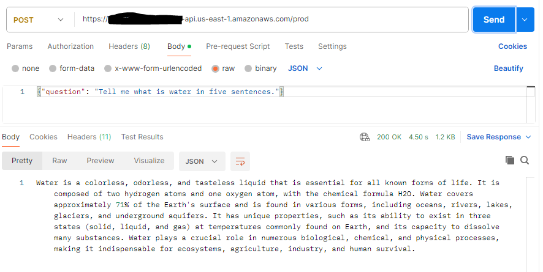

# An example of ethical and Safe Amazon Bedrock GenAI application using Anthropic's Claude 3.5 Sonnet model

This example demonstrates how Amazon Bedrock can be used for a Anthropic's Claude 3.5 Sonnet model using AWS Lambda and exposed as an API.  

This project is developed using Terraform.

## What does it build?
* Creates an AWS Lambda function that interacts with Amazon Bedrock
* Applies Amazon Bedrock Guardrails to follow ethical and safe rule to sanitize and block undesired requests and responses
* Uses Anthropic's Claude 3.5 Sonnet model for chat
* Creates an AWS API Gateway endpoint to expose the API

## Steps to run and test
* Deploy the Terraform code by running the provided `deploy.sh` file. Wait for the deploy to finish.  It will print out the API endpoint for you to use.
  * 
* Example of unethical or unsafe request
  * 

## References
Learn about:
* [Amazon Bedrock](https://aws.amazon.com/bedrock/)
* Amazon Bedrock [Guardrails](https://aws.amazon.com/bedrock/guardrails/)
* AWS Bedrock [Foundation Models](https://docs.aws.amazon.com/bedrock/latest/userguide/models-supported.html)
* [Anthropic's Claude 3.5 Sonnet model](https://www.anthropic.com/news/claude-3-5-sonnet)
* [Hashicorp Terraform](https://registry.terraform.io/providers/hashicorp/aws/latest/docs)